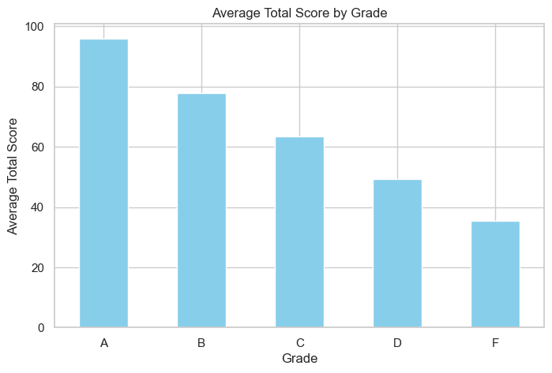
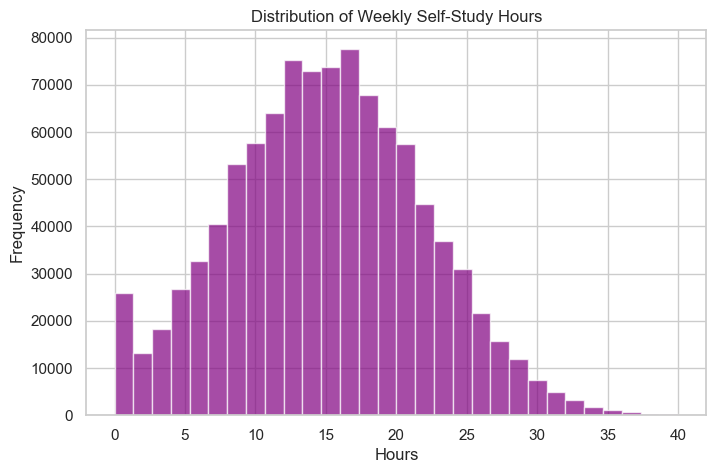

# 📊 Student Performance Data Analysis

This project performs **exploratory data analysis (EDA)** and **visualization** on a Student Performance dataset.  
We clean, analyze, and visualize data to uncover patterns between **study habits, attendance, participation, and grades**.  

---

## ✨ Features
- Load and explore dataset using **pandas**  
- Handle missing values and inspect data structure  
- Perform **basic statistical analysis** (mean, median, std, etc.)  
- Group data by categorical variable (**grades**) and compute averages  
- Visualize trends and relationships using **matplotlib** and **seaborn**  

---

## 🛠️ Requirements

Ensure you have the following Python libraries installed:

```bash
pip install pandas matplotlib seaborn
```

---

## 📂 Dataset

- The dataset used is Student Performance Data (CSV file from Kaggle).

Columns:

- student_id (unique identifier)
- weekly_self_study_hours
- attendance_percentage
- class_participation
- total_score
- grade 

---

## 📘 Tasks
**Task 1: Load and Explore the Dataset**

- Loaded CSV using pandas
- Displayed first few rows with .head()
- Checked data types and missing values
- Cleaned data (no missing values found in this dataset ✅)

**Task 2: Basic Data Analysis**

- Computed descriptive statistics using .describe()
- Grouped by grade to analyze average total scores
- Identified patterns in study hours, attendance, and grades

**Task 3: Data Visualization**

We created 4 types of plots:

- Line Chart: Total score trends over student IDs
- Bar Chart: Average total score grouped by grade
- Histogram: Distribution of weekly self-study hours
- Scatter Plot: Relationship between attendance percentage and total score

---

## 📊 Sample Visualizations

- Bar Chart (Average Scores by Grade)


Histogram Plot (Weekly Self Study Hour Distribution)


---

## 🚀 How to Run

1. Clone this repository or download the notebook/script.
2. Ensure required libraries are installed.
3. Place dataset in the dataset/ folder.
4. Run the Jupyter notebook or Python script.
```bash
jupyter notebook student-performance-data-analysis.ipynb
```

---

## 📌 Key Insights

- Higher weekly study hours tend to correlate with better scores.
- Attendance percentage shows a positive relationship with total scores.
- Grades reflect consistent patterns in performance distributions.

---

## 🙌 Acknowledgments

- Dataset: Kaggle Student Performance Dataset
- Libraries: pandas, matplotlib, seaborn
-My amazing Coding Buddy, ChatGPT for the immense code debugging assistance.
- My Wonderful instructors at the PLP Python Dev Module
